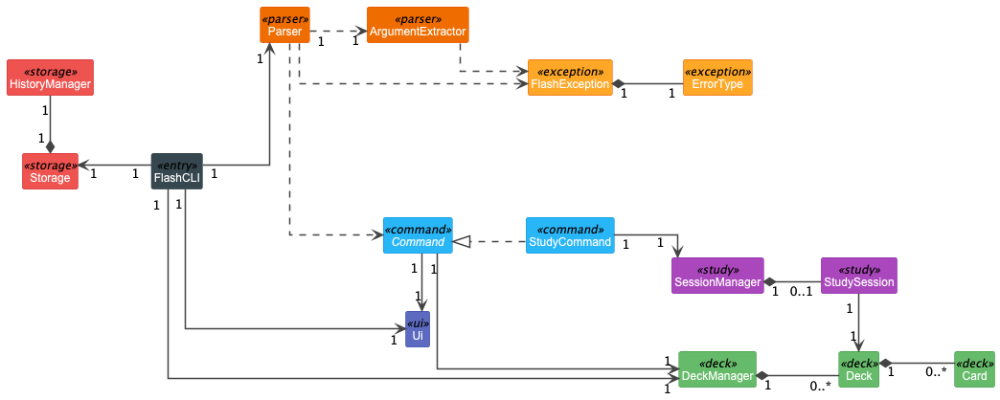
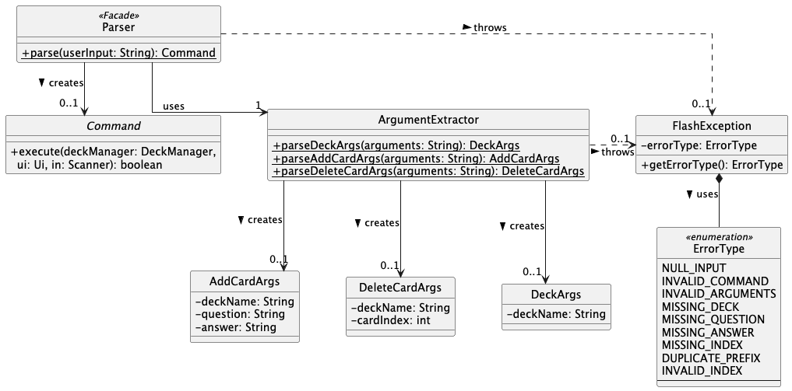
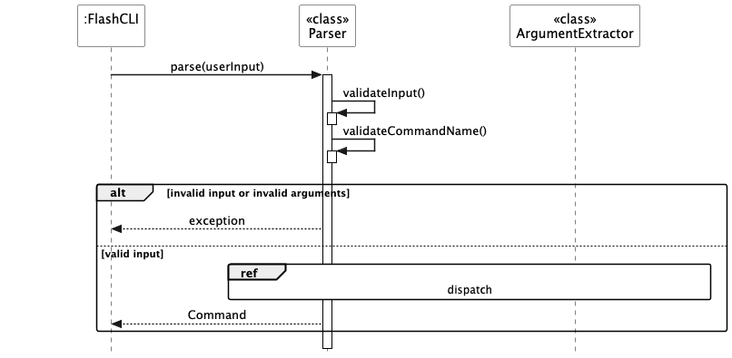
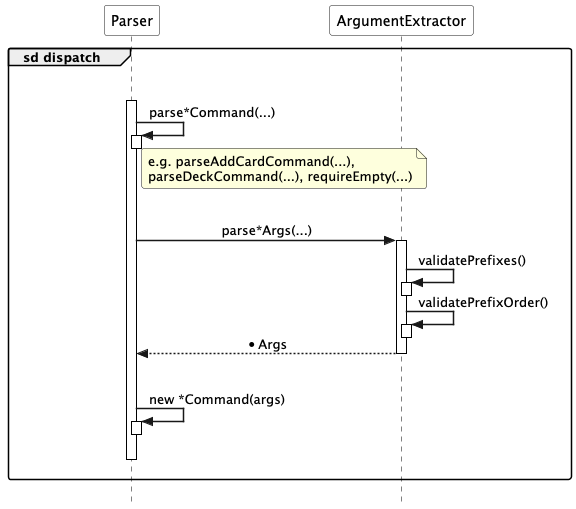
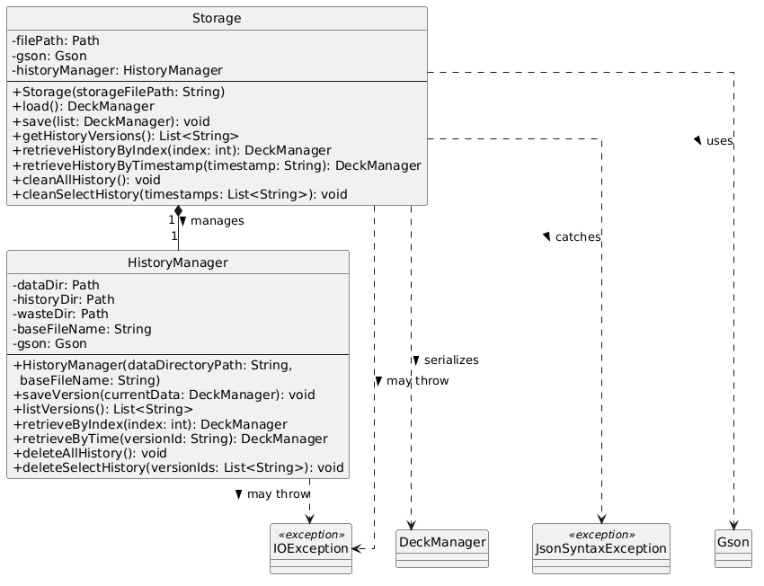
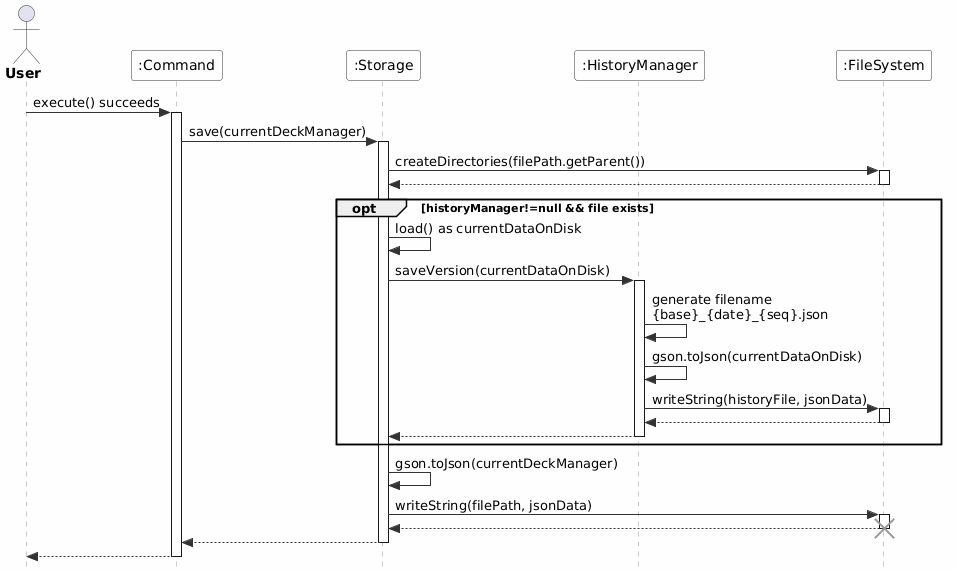
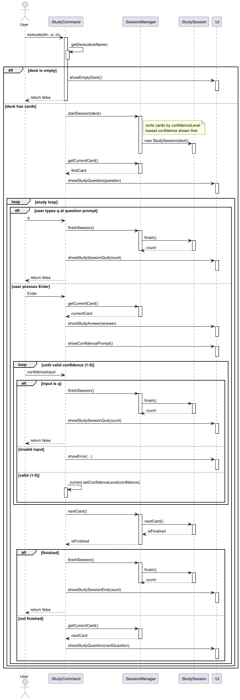
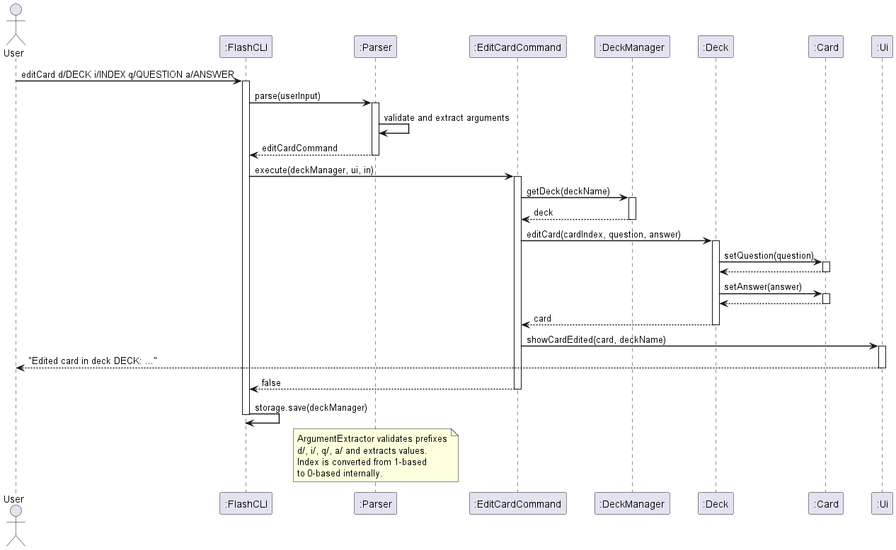

# Developer Guide

## Acknowledgements
FlashCLI was built from scratch as an original project. The following sources provided
inspiration for certain features and design decisions:

**Anki** ([https://apps.ankiweb.net](https://apps.ankiweb.net))
- The confidence-based card ordering feature in FlashCLI's Study module was inspired by
  Anki's spaced repetition system, where cards are scheduled based on how well the user
  knows them. Our implementation is entirely new and uses a simpler ascending confidence
  sort rather than Anki's full SM-2 spaced repetition algorithm.
- The concept of storing a per-card confidence/difficulty rating that persists across
  sessions was also drawn from Anki's card rating system (Again / Hard / Good / Easy).
  Our implementation uses a 1–5 integer scale instead.

**Quizlet** ([https://quizlet.com](https://quizlet.com))
- The basic flashcard deck-and-card data model (decks containing question-answer card pairs)
  was inspired by Quizlet's sets and terms structure. Our implementation is entirely new.
- The study session workflow of showing a question, waiting for user input, then revealing
  the answer, was inspired by Quizlet's Learn mode. Our implementation is entirely new
  and adapted for a CLI environment.

## Design & implementation

FlashCLI is organised into six distinct layers, each with a clearly defined responsibility.
The architecture diagram below shows the relationships between all major classes.

- **Entry point** - `FlashCLI` initialises the application, owns the `DeckManager` and `Storage`
  instances, and drives the main input loop.
- **UI** - `Ui` handles all terminal output, keeping display logic separate from business logic.
- **Parser** - `Parser` and `ArgumentExtractor` translate raw user input into typed `Command`
  objects, throwing `FlashException` on any invalid input.
- **Command** - The `Command` interface defines a single `execute()` method. Each concrete
  subclass (e.g. `AddCardCommand`, `StudyCommand`) encapsulates the logic for one user action.
- **Deck** - `DeckManager` owns a collection of `Deck` objects, each of which contains
  zero or more `Card` objects. This layer holds all flashcard data at runtime.
- **Study** - `StudyCommand` delegates to `SessionManager`, which manages a single active
  `StudySession`. Cards are ordered by ascending confidence level so weaker cards are drilled first.
- **Storage** - `Storage` persists the full `DeckManager` state to `data/storage.json` after
  every command. `HistoryManager` maintains versioned snapshots in `data/history/`.
- **Exception** - `FlashException` wraps an `ErrorType` enum value, giving every error a
  consistent message and a single catch point in `FlashCLI.executeCommand()`.

## Parser
The Parser component is responsible for converting raw user input into executable `Command` objects.
It is designed as a `<<Facade>>`, exposing a single static entry point `Parser.parse(userInput)`
that hides all internal parsing complexity from the rest of the application.

#### Class Structure

The diagram below shows the classes in the Parser component and how they interact.

**Key classes:**
- `Parser` - facade that validates input and dispatches to the correct parse helper
- `ArgumentExtractor` - handles all prefix-based argument extraction and validation
- `AddCardArgs`, `DeleteCardArgs`, `DeckArgs` - immutable data holders for parsed arguments
- `Command` - interface implemented by all command objects returned by the parser

#### Parse Flow

The sequence diagram below shows the high-level flow when `FlashCLI` calls `Parser.parse(userInput)`.

1. `validateInput()` checks that the input is non-null and non-blank
2. `validateCommandName()` checks the command keyword against the list of valid commands
3. If either check fails, a `FlashException` is thrown back to `FlashCLI`
4. Otherwise, the `dispatch` interaction (detailed below) is triggered

#### Dispatch

The diagram below shows what happens inside the `dispatch` ref frame.

`Parser` routes to one of several private helpers (e.g. `parseAddCardCommand`, `requireEmpty`).
For commands that require arguments, the helper delegates to `ArgumentExtractor.parse*Args(...)`,
which validates prefixes, validates their order, extracts the values, and returns a typed args object.
`Parser` then constructs and returns the appropriate `Command`.

### Parser Design Rationale

The `Parser` and `ArgumentExtractor` classes were designed with the following principles in mind:

* **Single Responsibility Principle (SRP):** `Parser` focuses solely on converting raw user input
  into a typed `Command` object. It has no knowledge of how `Ui` displays output, how `DeckManager`
  stores data, or how `Storage` persists state. `ArgumentExtractor` is further split out to handle
  all prefix validation and value extraction, keeping `Parser` itself thin. This separation makes
  both classes independently testable and reusable.

* **Defensive Programming:** `Parser` is the application's first line of defence against malformed
  input. It validates that input is non-blank, that the command keyword is recognised, that all
  required prefixes are present exactly once, and that prefixes appear in the correct order - all
  before any command logic executes. Any violation throws a `FlashException` immediately. This means
  every `Command` object that reaches `FlashCLI.executeCommand()` is guaranteed to be well-formed,
  and no downstream class needs to re-validate its inputs.

* **Stateless Utility:** `Parser` and `ArgumentExtractor` are implemented as stateless classes with
  a `private` constructor and all-`static` methods. There is no need to instantiate either class,
  which simplifies the design and makes the parsing pipeline easy to reason about - given the same
  input string, `Parser.parse()` always produces the same `Command`.

## Storage

The `Storage` and `HistoryManager` components are responsible for saving the application's data (flashcards and decks) to disk and loading it back. A key enhancement is the integrated **version control system**, which automatically creates a historical backup every time data is saved, allowing users to recover from accidental data loss or corruption.

#### Class Structure

The diagram below illustrates the relationship between the main `Storage` class and its helper, the `HistoryManager`.

*Diagram: Shows the composition where `Storage` owns one `HistoryManager`. Lists core public methods for both classes.*

**Key Classes:**
*   `Storage` - The primary facade for data persistence. It manages the main data file (e.g., `flashcards.json`) and delegates historical versioning operations to the `HistoryManager`.
*   `HistoryManager` - A dedicated class that manages the lifecycle of historical data snapshots, following the **Single Responsibility Principle**. It handles saving, listing, retrieving, and cleaning historical versions in the `./data/history/` and `./data/waste/` directories.

#### Save & Load Flow with Auto-Backup

The sequence diagram below shows the enhanced flow when the application saves data. The critical addition is the automatic creation of a historical version **before** the new data overwrites the existing file.

*Diagram: Illustrates the sequence of `Command` -> `Storage.save()` -> `Storage.load()` (to get current data) -> `HistoryManager.saveVersion()` (for backup) -> write to main file.*

1.  A `Command` (e.g., `AddCardCommand`) calls `storage.save(currentDeckManager)` upon successful execution.
2.  `Storage` checks if the main data file exists and if `HistoryManager` is initialized.
3.  If conditions are met, `Storage` loads the current data from disk (`currentDataOnDisk`).
4.  `Storage` delegates to `historyManager.saveVersion(currentDataOnDisk)`. The `HistoryManager` generates a new timestamped file (e.g., `flashcards_20260317_001.json`) in the `./data/history/` directory.
5.  Finally, `Storage` serializes the new `currentDeckManager` and writes it to the main data file, completing the operation.

#### Design Decisions & Implementation

**1. Historical Version Naming and Storage**
*   **Decision:** Historical files are named using a `{basename}_{date}_{sequence}.json` pattern (e.g., `flashcards_20260317_001.json`). Files are stored in `./data/history/` and moved to `./data/waste/` upon deletion.
*   **Rationale:** The `date_sequence` format is more human-readable and organized than a pure epoch timestamp or a long datetime string (`yyyyMMdd_HHmmss`). The date prefix allows for potential future cleanup policies (e.g., keep only last 7 days), and the auto-incrementing 3-digit sequence number guarantees uniqueness within the same day.
*   **Alternative Considered:** Using the exact save time (`yyyyMMdd_HHmmss`). This was rejected as it is less readable for the purpose of manual inspection and doesn't as naturally prevent collisions if multiple saves occur within the same second.

**2. The `waste` Directory and Safe Deletion**
*   **Decision:** Historical versions are "deleted" by being moved to a `./data/waste/` subdirectory, not permanently erased from disk.
*   **Rationale:** This acts as a second-level safety net or a "recycle bin". If a user accidentally cleans the history via the application, the files are still physically recoverable by a system administrator or advanced user from the `waste` directory, preventing total data loss from a UI mistake.
*   **Implementation:** The `deleteAllHistory()` and `deleteSelectHistory()` methods use `Files.move()` with the `StandardCopyOption.REPLACE_EXISTING` flag, ensuring the operation succeeds even if a file with the same name already exists in the `waste` directory.

**3. Loose Coupling and Graceful Degradation**
*   **Decision:** The `HistoryManager` is initialized in the `Storage` constructor. If initialization fails (e.g., due to insufficient file permissions), it is set to `null`, and all history-related features are silently disabled.
*   **Rationale:** This ensures the **core save/load functionality remains available** even if the versioning enhancement fails. The application should not crash because an optional backup feature cannot be initialized. All public history proxy methods in `Storage` (like `getHistoryVersions()`, `cleanAllHistory()`) check for a `null` `HistoryManager` and fail gracefully with a warning message to `System.err`.
*   **Alternative Considered:** Making `HistoryManager` a mandatory component and throwing an exception from the `Storage` constructor if it fails to initialize. This was rejected for being too brittle, as versioning is a non-core enhancement to the primary data persistence responsibility.

**4. Robust JSON Parsing with Gson**
*   **Decision:** Using the Gson library for JSON serialization/deserialization. The `parse()` method in `Storage` and `parseHistoricalData()` in `HistoryManager` catch `JsonSyntaxException`.
*   **Rationale:** JSON is a human-readable, debuggable format. Gson handles the complexity of serializing the entire `DeckManager` object graph. Catching `JsonSyntaxException` is crucial for robustness; if the data file becomes corrupted (e.g., edited manually and saved incorrectly), the application will log a warning, return an empty `DeckManager`, and continue running, rather than crashing on startup.
*   **Error Handling:** Upon catching a `JsonSyntaxException`, the methods print a warning to `System.err` and return a new, empty `DeckManager` object. This provides a clear error signal in the console while allowing the user to continue using the application with a blank state.

## Study

The Study package implements FlashCLI's active-recall workflow: a user selects a deck,
studies cards one at a time in order of ascending confidence, rates their confidence after
each answer, and receives a session summary when they finish or quit.

The component consists of three collaborating classes:

| Class | Responsibility |
|---|---|
| `StudyCommand` | Entry point — bridges the Command layer to the study subsystem and owns the input loop |
| `SessionManager` | Owns and lifecycle-manages the single active `StudySession` |
| `StudySession` | Sorts cards by confidence on construction, tracks position, provides card access |

#### Class Structure

The diagram below shows the Study package and its relationships to the surrounding layers.

Key design decisions visible in the diagram:

- `SessionManager` **composes** `StudySession` (0..1) — at most one session is active at any
  time. Calling `startSession()` while a session is already active throws
  `SESSION_ALREADY_IN_PROGRESS`.
- `StudySession` holds a **final** reference to a **sorted copy** of the deck — the original
  deck's order is preserved; only the session's internal view is sorted by confidence.
- `StudyCommand` depends on `SessionManager`, `DeckManager`, and `Ui` but **not** on
  `StudySession` directly. All session interaction is mediated through `SessionManager`.
- `Card` carries a `confidenceLevel` field (default `0`) which `StudyCommand` updates after
  each answer via `card.setConfidenceLevel(confidence)`. This persists to `Storage` and
  influences card ordering in future sessions.

#### How a Study Session Works

The sequence diagram below shows the end-to-end flow from `StudyCommand.execute()` being
called to the session summary being printed.

The flow has three phases:

**1. Setup**

`StudyCommand` retrieves the deck from `DeckManager`. If the deck is empty,
`Ui.showEmptyDeck()` is called and the command returns immediately. Otherwise,
`SessionManager.startSession(deck)` is called, which creates a new `StudySession`.
On construction, `StudySession` makes a sorted copy of the deck's cards, ordering them
by `confidenceLevel` ascending so the cards the user is least confident about are drilled
first. The first question is shown immediately before entering the loop.

**2. Loop**

On each iteration, the user presses Enter to reveal the current card's answer.
After the answer is shown, `StudyCommand` prompts the user for a confidence rating (1–5)
via `Ui.showConfidencePrompt()`. The rating is validated in an inner loop — non-integer
input and out-of-range values show an error and re-prompt; typing `q` during the confidence
prompt exits the session immediately. Once a valid rating is received, the card's
`confidenceLevel` is updated. `SessionManager.nextCard()` then advances the index.
If the end of the deck is reached, the session ends automatically.

**3. Teardown**

`SessionManager.finishSession()` delegates to `StudySession.finish()`, which calculates
cards reviewed (capped at deck size), sets `currentIndex = -1` as a consumed sentinel,
and returns the count. `Ui` prints the session summary.

#### Confidence-Based Card Ordering

The diagram below shows what happens inside `StudySession`'s constructor when
`startSession(deck)` is called.

`StudySession` does not modify the original `Deck` object. Instead it:

1. Retrieves the card list via `deck.listCards()`
2. Sorts the list in-place by `getConfidenceLevel()` ascending using
   `Comparator.comparing(Card::getConfidenceLevel)`
3. Creates a new `Deck` with the same name and assigns the sorted list via `setCards()`
4. Stores this sorted copy as `this.deck`

This means cards the user rated lowest in previous sessions appear first in the next
session, implementing a lightweight spaced-repetition policy without requiring any
additional data structures or scheduling algorithms.

#### Defensive Coding

The Study package applies defensive programming at every public boundary.

**Guards and assertions applied:**

| Method | Guard type | What it checks |
|---|---|---|
| `StudySession(deck)` | Explicit null check | `deck != null`; throws `IllegalArgumentException` |
| `StudySession(deck)` | Post-condition assert | `currentIndex == 0` after construction |
| `startSession(deck)` | Explicit null check | `deck != null`; throws `INVALID_ARGUMENTS` |
| `startSession(deck)` | State check | No active session; throws `SESSION_ALREADY_IN_PROGRESS` |
| `startSession(deck)` | Post-condition assert | `hasActiveSession()` and deck name matches |
| `getCurrentCard()` | Bounds check | `0 <= currentIndex < deck.getSize()`; throws `CARD_NOT_FOUND` |
| `getCurrentCard()` | Post-condition assert | returned `card != null` |
| `nextCard()` | Pre-condition assert | `currentIndex >= 0` (session not already consumed) |
| `nextCard()` | Post-condition assert | index advanced by exactly 1 |
| `finish()` | Pre-condition assert | `currentIndex >= 0` (not called twice) |
| `finish()` | Invariant assert | `0 <= finalCount <= deck.getSize()` |
| `finishSession()` | Post-condition assert | `activeSession == null` after clearing |
| `finishSession()` | Post-condition assert | returned count `>= 0` |

All explicit guards throw `FlashException` (user-facing errors) or `IllegalArgumentException`
(programmer errors). Assertions catch logic errors during development when the JVM is run
with `-ea` and have no effect in production.

Logging is applied at three levels across `SessionManager` and `StudySession`:
- `FINE` — normal control flow (method entry, index values)
- `WARNING` — bad inputs or unexpected state (null deck, no active session, out-of-bounds)
- `INFO` — significant state changes (session started, session finished with card count)

#### Design Rationale

**Why separate `SessionManager` from `StudySession`?**

An earlier design had `StudyCommand` interact with `StudySession` directly. This was
rejected because it forced `StudyCommand` to manage session lifecycle — checking for null,
clearing state after finish — violating the Single Responsibility Principle. With
`SessionManager` as an intermediary:

- `StudyCommand` only calls high-level operations: `startSession`, `getCurrentCard`,
  `nextCard`, `finishSession`.
- `StudySession` only manages index arithmetic and card retrieval.
- The confidence-sorting logic is entirely contained in `StudySession`'s constructor
  and can be changed (e.g., switching to a spaced-repetition algorithm) without touching
  `StudyCommand` or `SessionManager`.

**Why sort a copy of the deck rather than the original?**

Sorting the original deck's `cardList` in `Deck` would change the card order permanently,
affecting `listCards` output and card indices used by `deleteCard` and `editCard`.
Creating a sorted copy in `StudySession` isolates ordering to the study subsystem,
leaving the deck's authoritative order intact.

**Alternatives considered:**

| Alternative | Reason rejected |
|---|---|
| Merge `SessionManager` into `StudyCommand` | Mixes command logic with session lifecycle; harder to unit test |
| Sort cards in `DeckManager` before passing to `StudyCommand` | `DeckManager` should not know about study ordering; violates SRP |
| Use an iterator pattern over `Deck` | Cleaner API but adds infrastructure to the Deck layer unnecessarily |
| Sort the original `cardList` in `Deck` | Corrupts card indices used by other commands |

## Deck

The Deck component is FlashCLI's core data layer. It holds all flashcard data
at runtime and provides the authoritative storage structure that every other
component reads from or writes to.

The component consists of three collaborating classes:

| Class | Responsibility |
|---|---|
| `DeckManager` | Top-level container — owns and manages the full collection of named `Deck` objects |
| `Deck` | Mid-level container — owns an ordered list of `Card` objects and exposes CRUD operations on them |
| `Card` | Leaf data object — holds a question, answer, and a persisted confidence level |

#### Class Structure

The diagram below shows the Deck component's three classes and their
composition hierarchy.

Key observations from the diagram:

- `DeckManager` uses a `HashMap<String, Deck>` keyed by deck name, giving
  O(1) lookup by name for all card operations.
- `Deck` stores cards in an `ArrayList<Card>`, preserving insertion order
  and supporting stable index-based access used by `deleteCard` and
  `editCard`.
- `Card` exposes both getters **and** setters for `question`, `answer`,
  and `confidenceLevel`. Setters are intentionally narrow — only
  `EditCardCommand` and `StudyCommand` may mutate a card after creation.
- The hierarchy is strictly one-directional: `DeckManager` knows about
  `Deck`, and `Deck` knows about `Card`, but neither child class holds a
  reference back to its parent.

#### Operations

**Deck management (`DeckManager`)**

`createDeck(deckName)` — Creates a new empty `Deck` and inserts it into
the map. Throws `DUPLICATE_DECK` if a deck with that name already exists.

`deleteDeck(deckName)` — Removes the deck from the map entirely, along
with all its cards. Throws `DECK_NOT_FOUND` if the name is not present.

`getDeck(deckName)` — Returns the `Deck` instance for the given name.
Used by all card-level commands before they delegate down to `Deck`.
Throws `DECK_NOT_FOUND` on a miss.

`listDecks()` — Returns a sorted `List<String>` of all deck names.
Sorting ensures a stable, predictable display order.

**Card management (`Deck`)**

`addCard(question, answer)` — Constructs a new `Card` with `confidenceLevel`
defaulting to `0` and appends it to `cardList`. Returns the created `Card`
so the caller can confirm or display it.

`deleteCard(cardIndex)` — Removes and returns the `Card` at the given
0-based index. Throws `INVALID_INDEX` if the index is out of range.

`editCard(cardIndex, question, answer)` — Mutates `question` and `answer`
on the existing `Card` in-place via `setQuestion()` and `setAnswer()`.
The card's `confidenceLevel` and position in the list are preserved.
Returns the updated `Card`.

`getCard(cardIndex)` — Returns the `Card` at the given 0-based index
without removing it. Throws `INVALID_INDEX` if out of range.

`getSize()` / `listCards()` — Read-only accessors used by display
commands and the Study subsystem.

`clearCards()` — Empties `cardList`. Used by the history-restore flow
when `Storage` rebuilds a `Deck` from a JSON snapshot.

#### Edit Card Sequence

The diagram below shows the end-to-end flow for `editCard d/DECK i/INDEX
q/QUESTION a/ANSWER`, which is the most complex card-level operation as it
involves index conversion, two mutable fields, and a confirmation display.

1. The user types `editCard d/DECK i/INDEX q/QUESTION a/ANSWER`.
2. `FlashCLI` calls `Parser.parse(userInput)`, which delegates to
   `ArgumentExtractor.parseEditCardArgs(...)`. The extractor validates the
   `d/`, `i/`, `q/`, `a/` prefixes (in order) and converts the user-facing
   1-based index to a 0-based `cardIndex` internally.
3. `Parser` constructs and returns an `EditCardCommand`.
4. `FlashCLI` calls `editCardCommand.execute(deckManager, ui, in)`.
5. `EditCardCommand` calls `deckManager.getDeck(deckName)` to retrieve
   the target `Deck`.
6. `EditCardCommand` calls `deck.editCard(cardIndex, question, answer)`,
   which forwards `setQuestion(question)` and `setAnswer(answer)` to the
   `Card`. The updated `Card` is returned.
7. `EditCardCommand` calls `ui.showCardEdited(card, deckName)` to print
   the confirmation message.
8. Control returns to `FlashCLI`, which calls `storage.save(deckManager)`
   to persist the change.

#### Design Rationale

**`HashMap` in `DeckManager` and `ArrayList` in `Deck` serve different access patterns.**

Deck lookup is always by name (a string key), making `HashMap` the natural
choice for O(1) retrieval. Card access is always by positional index —
either explicitly by the user (`deleteCard i/2`) or implicitly by iteration
(study, list) — so `ArrayList` preserves insertion order and gives O(1)
indexed access. A `HashMap<Integer, Card>` inside `Deck` would add
unnecessary complexity without any lookup benefit.

**`confidenceLevel` is stored on `Card` so it persists automatically across sessions.**

Storing confidence on `Card` means it is automatically serialised and
deserialised by `Storage` as part of the normal save/load cycle. If it
were stored in `StudySession`, it would be lost when the session ends.
Placing it on `Card` also allows `DeckManager` to export accurate
statistics about the entire collection without needing to know anything
about the Study subsystem.

**`editCard` mutates the existing `Card` in-place rather than replacing it.**

Replacing the card at an index (delete + insert) would shift the 0-based
indices of all subsequent cards, invalidating any in-flight reference other
commands or the active study session might hold. Mutating the existing
object avoids this side-effect entirely and keeps `confidenceLevel` intact —
a card's difficulty rating should survive an edit to its wording.

**`setCards()` access is restricted to the Study and Storage subsystems.**

`setCards()` replaces the entire `cardList` at once. Exposing it broadly
would allow any command to silently overwrite all cards. It is used in
exactly two legitimate places: `StudySession` (to install a sorted copy of
the list) and `Storage` (to rebuild a `Deck` from a JSON snapshot). All
other mutations go through the fine-grained `addCard` / `deleteCard` /
`editCard` methods, which validate indices and maintain list integrity.

## Product scope
### Target user profile

FlashCLI targets **students who prefer a keyboard-driven workflow** and want a lightweight,
distraction-free tool for active recall revision. The ideal user:

- Is comfortable working in a terminal and prefers typed commands over graphical interfaces
- Studies multiple subjects simultaneously and wants their revision material clearly separated by topic
- Revises on a personal machine and wants data stored locally, without requiring an internet connection or account login
- Values speed and want to capture a new flashcard or start a study session with a single command, without navigating menus
- Is preparing for exams and wants to focus their limited revision time on the cards they struggle with most

### Value proposition

FlashCLI solves the problem of **friction in active-recall revision** for CLI-native students.

Existing tools such as Anki and Quizlet require a browser or dedicated GUI application, which
pulls students out of their terminal-based workflow. Neither offers a fully keyboard-driven
experience optimised for speed of entry and session startup.

## User Stories

| Version | As a ...                    | I want to ...                                        | So that I can ...                                  |
|---------|-----------------------------|------------------------------------------------------|----------------------------------------------------|
| v1.0    | Student starting revision   | create subjects for my modules                       | my flashcards are clearly separated                |
| v1.0    | Student starting revision   | see an overview of all my subjects                   | I know what I am currently revising                |
| v1.0    | Student starting revision   | start with a clean revision space                    | I can organise my own material from scratch        |
| v1.0    | Student learning new content| quickly add a question and answer                    | I can capture important points while studying      |
| v1.0    | Student starting revision   | see how many flashcards I have under each subject    | I can gauge revision workload                      |
| v1.0    | Student                     | have the app work without internet access            | I can revise anywhere                              |
| v1.0    | Student revising for an exam| test myself using my flashcards                      | I can practise active recall                       |
| v1.0    | Student revising for an exam| see questions before answers                         | I am forced to think before checking               |
| v1.0    | Student revising for an exam| reveal answers only when I choose to                 | I can assess my recall honestly                    |
| v1.0    | Student                     | focus my revision on one subject at a time           | I am not overwhelmed                               |
| v1.0    | Student                     | revise flashcards quickly without leaving my CLI workflow | I maintain my productivity environment        |
| v1.0    | Student                     | have my data stored locally                          | I remain in control of my revision material        |
| v1.0    | Student learning new content| delete flashcards that are no longer useful          | outdated content does not distract me              |
| v2.0    | Student revising for an exam| quiz myself with a random subset of the cards        | I can vary my practice                             |
| v2.0    | Student revising for an exam| revisit flashcards I struggled with                  | I can focus on weak areas                          |
| v2.0    | Student learning new content| edit flashcards                                      | I can refine wording as my understanding improves  |
| v2.0    | Student starting revision   | mark my confidence when inputting flashcards         | I can see how my confidence level changed during revision |
| v2.0    | Student revising for an exam| see statistics about my flashcard collection         | I can track my study progress                      |

## Non-Functional Requirements

{Give non-functional requirements}

## Glossary

* *glossary item* - Definition

## Instructions for manual testing

{Give instructions on how to do a manual product testing e.g., how to load sample data to be used for testing}
